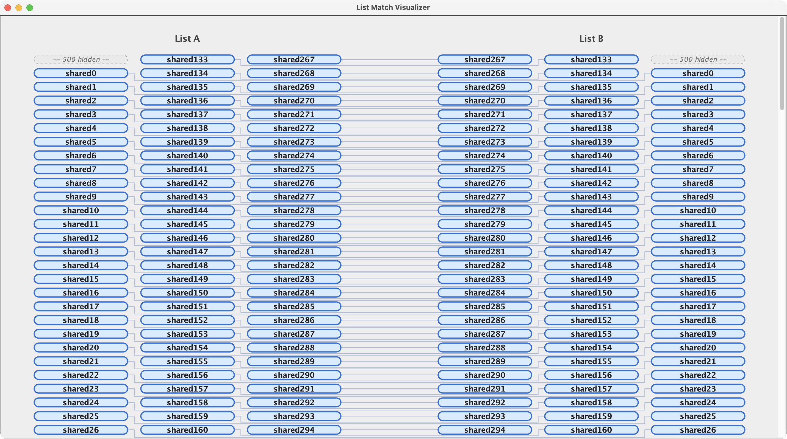
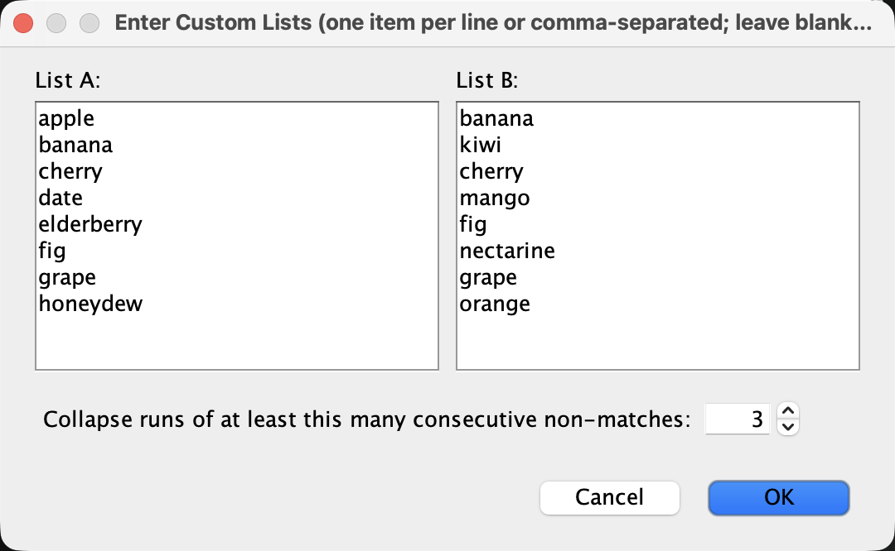
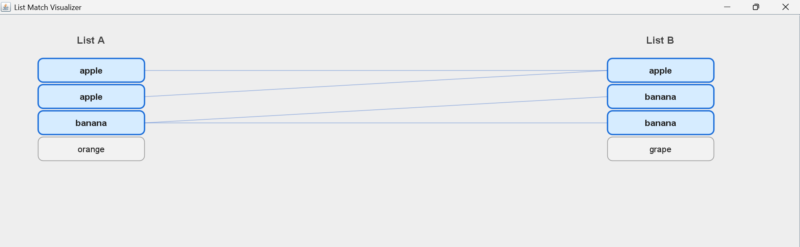
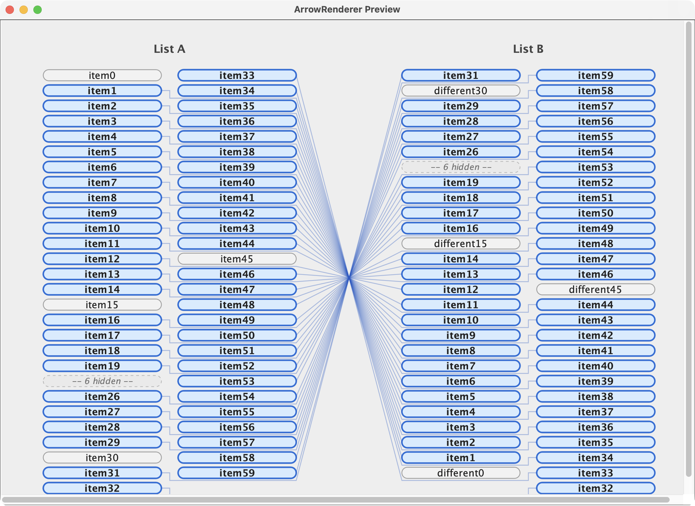
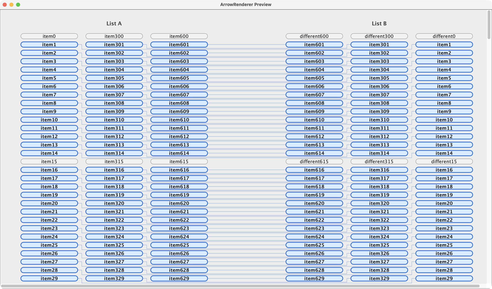

# List Match Visualizer


## Current Progress Snapshot



*All four components are complete and integrated into a runnable Java Swing
app. The above shows a user-entered 1000-item list (500 non-matching, 400
matching, 100 non-matching) rendered through the real application: long
non-matching runs collapse into "-- N hidden --" gap markers on both sides,
while the matching middle section auto-fits into multiple columns — and the
column count keeps adjusting live as the window is resized.*

## Table of Contents

- [What This Project Is About](#what-this-project-is-about)
- [Concepts Used](#concepts-used)
- [Project Structure](#project-structure)
- [Main Application](#main-application)
- [How Matching Works](#how-matching-works) 
- [Application Screenshots](#application-screenshots)
- [Progress](#progress)
- [Real-World Use Cases](#real-world-use-cases)
- [Who Did What](#who-did-what)
- [Group Members](#group-members)

## What This Project Is About

This project is a Java Swing application built for our Digital Graphics
and Image Processing course. It takes two lists of items as input,
identifies which elements are common to both lists, and visually
represents those relationships by drawing arrows connecting the
matching items across two columns.

The goal was to practice 2D graphics rendering (custom drawing with
`Graphics2D`), coordinate/layout math, and basic UI interactivity, while
also applying core data-structure concepts (sets, lists) to solve a
comparison problem.

## Concepts Used

- **Java Swing** — building the GUI window, panels, text fields, and buttons.
- **Custom 2D graphics (`Graphics2D`)** — drawing rounded rectangles and
  connecting lines directly onto a panel.
- **Set/List operations** — using `HashSet` intersection to find common
  elements between the two lists.
- **Coordinate geometry** — computing anchor points on boxes so arrows
  connect cleanly regardless of layout (columns, gaps, box height).
- **Object-oriented design** — splitting the program into separate
  classes with single responsibilities (data/matching, box rendering,
  arrow rendering, integration).
- **Event-driven programming** — responding to button clicks to
  re-render the visualization with new input.

## How Matching Works

1. The application receives two lists, List A and List B.
2. The Matcher identifies common values and records the corresponding original indices.
3. BoxRenderer lays out the list items and visually distinguishes matched and unmatched items.
4. ArrowRenderer uses the matching index pairs and box anchor points to draw connections between corresponding items.

The result is a visual representation of the overlap between the two lists, including the positions of matching elements.

## Project Structure

```
src/main/java/org/example/
├── Matcher.java        # data + matching logic
├── BoxRenderer.java    # box drawing + layout
├── ArrowRenderer.java  # arrow drawing
└── Main.java            # integration, UI, entry point
```
## Main Application

`Main.java` is the entry point of the List Match Visualizer. It integrates the `Matcher`, `BoxRenderer`, and `ArrowRenderer` components to display two lists, highlight common and non-common elements, and draw connections between matching items. The application uses Java Swing and supports scrolling for large lists.

### Running the Application

1. Open the project in IntelliJ IDEA.
2. Navigate to `src/main/java/org/example/Main.java`.
3. Run the `main()` method.
4. The List Match Visualizer window will open.

### Application Screenshots

**Custom list input**

Users can type or paste their own values for List A and List B, and control
how aggressively long non-matching runs are collapsed. Leaving a field blank
falls back to sample data.



**Basic visualization**



**Large-list visualization**

Gap markers collapsing long non-matching runs, combined with the multi-column
auto-fit layout for the matching section:


## Progress

**Status: All 4 core components implemented.**

### ✅ Matcher (data + matching logic) — merged
Finds common elements between the two input lists (handling duplicates
correctly) and exposes original-index match pairs for the rendering
components to consume.

### ✅ BoxRenderer (box layout + drawing) — merged
Renders both list columns as boxes, with the following handled:
- Matched items visually highlighted.
- Large lists auto-fit box sizing to the available space and wrap into
  multiple columns, and the column count re-adjusts live as the window
  is resized, instead of forcing endless single-column scrolling.
- Long non-matching stretches are collapsed into a single "gap marker"
  row (e.g. "-- 500 hidden --") so sparse matches don't require scrolling
  past hundreds of irrelevant rows. The run-length threshold for this is
  configurable from the input dialog.

See the "Large-list visualization" screenshot in
[Application Screenshots](#application-screenshots) above for both of these
in action together.

### ✅ ArrowRenderer (arrow drawing) — merged
Draws connecting lines between matched boxes using the anchor points
`BoxRenderer` exposes on each box. Uses a thin, semi-transparent stroke
so large numbers of overlapping arrows stay readable instead of turning
into a solid block of color. In multi-column layouts, arrows from outer
columns are routed through the gaps between rows (one lane per column)
rather than drawn straight across, so they never pass over other boxes.

Arrows connecting matched boxes on a small/medium list:



Arrows holding up at scale on a large (~900-item) list:



### ✅ Main (integration + UI)

Integrates Matcher, BoxRenderer, and ArrowRenderer into a runnable Java Swing application. Displays both lists, highlights matches, and draws connecting arrows.

## Real-World Use Cases

The core idea behind this program — visually linking matching items
across two separate collections — shows up in many practical scenarios:

- **Database schema mapping**: When migrating data between two systems,
  developers need to see which fields in an old database table
  correspond to fields in a new one. A visual connector like this makes
  mismatches and overlaps immediately obvious.
- **Plagiarism / duplicate detection**: Comparing two documents, code
  submissions, or datasets to highlight shared phrases, functions, or
  entries, so a reviewer can quickly see what overlaps.
- **Inventory reconciliation**: Matching a warehouse's recorded stock
  list against a supplier's shipment list to flag which items were
  successfully received versus which are missing or extra.
- **Bioinformatics / gene matching**: Visualizing shared genes or
  markers between two datasets (e.g. two species or two samples) is a
  common technique in comparative genomics research.
- **Curriculum or syllabus comparison**: Universities comparing two
  course syllabi to identify overlapping topics when deciding on credit
  transfers or avoiding redundant content.
- **UI/UX diagram tools**: The same arrow-and-node visualization pattern
  underlies tools like flowchart builders, mind maps, and org charts,
  where relationships between separate groups of items need to be shown
  clearly at a glance.

In short, any situation where two sets of information need to be
compared — and the connections between them explained visually rather
than just listed in text — is a real-world application of this concept.

## Who Did What

| Team Member | File | Contribution |
|---|---|---|
| Jiya Thakkar | `Matcher.java` | Designed the data representation for the two lists and implemented the logic to find common elements, including handling duplicate values correctly. |
| Dhriti Sarkar | `BoxRenderer.java` | Implemented the box layout and rendering for both list columns, including highlighting matched items, auto-fit sizing and multi-column wrapping for large lists, and gap markers for sparse matches. |
| Aangi Shah | `ArrowRenderer.java` | Implemented the arrow drawing logic connecting matched boxes between the two lists, including handling visual density for large match counts. |
| Heer Patel | `Main.java` | Integrating all components into a single application, building the input UI, and setting up the project structure/repo.Ran the application and verified visual output across basic matching, duplicate elements, long strings, and large-list scenarios.|

## Group Members

| Name | AU ID     |
|---|-----------|
| Jiya Thakkar | AU2420189 |
| Dhriti Sarkar | AU2420123 |
| Aangi Shah | AU2300055 |
| Heer Patel | AU2420114 |
